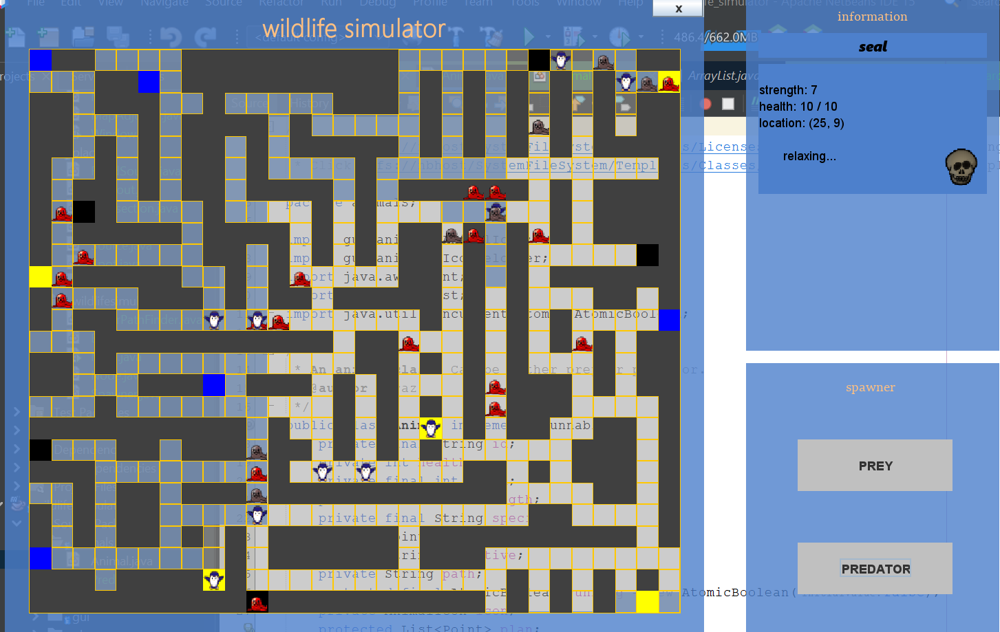

# wildlife-simulator-java

Simple project programmed in Java - a wildlife simulator of seals (predators) and penguins (preys). Preys can eat, drink and hide. Predators hunt preys and relax after doing so. New animals can be added/removed from the board. The prey's route can be changed. There can be only one prey at intersection at a time. Preys move on routes, while predators can move everywhere on the map. Predator cannot attack a prey when it is in the hideout. Each hideout, water source and food source has its name and given properties.
GUI made in Swing.

